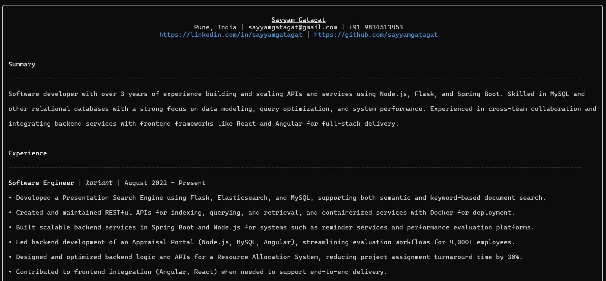

# 📄 Sayyam Gatagat – CLI Resume

A fun, terminal-based version of my resume.  
View it instantly in your terminal without downloading a file or opening a PDF.

Built with [Node.js](https://nodejs.org), [Chalk](https://github.com/chalk/chalk), and [Boxen](https://github.com/sindresorhus/boxen).

---

## 🚀 Quick Start

You can view my resume with a single command — no installation required:

```sh
npx sayyamgatagat

```

## 📦 Installation (Optional)

If you want to install it globally:
```
npm install -g @sayyamgatagat/resume
sayyamgatagat
```

## 👀 Preview

Here’s a sample of how it looks in the terminal:



## 🛠 Tech Stack

- Node.js – runtime

- Chalk – terminal colors

- Boxen - boxes and formatting